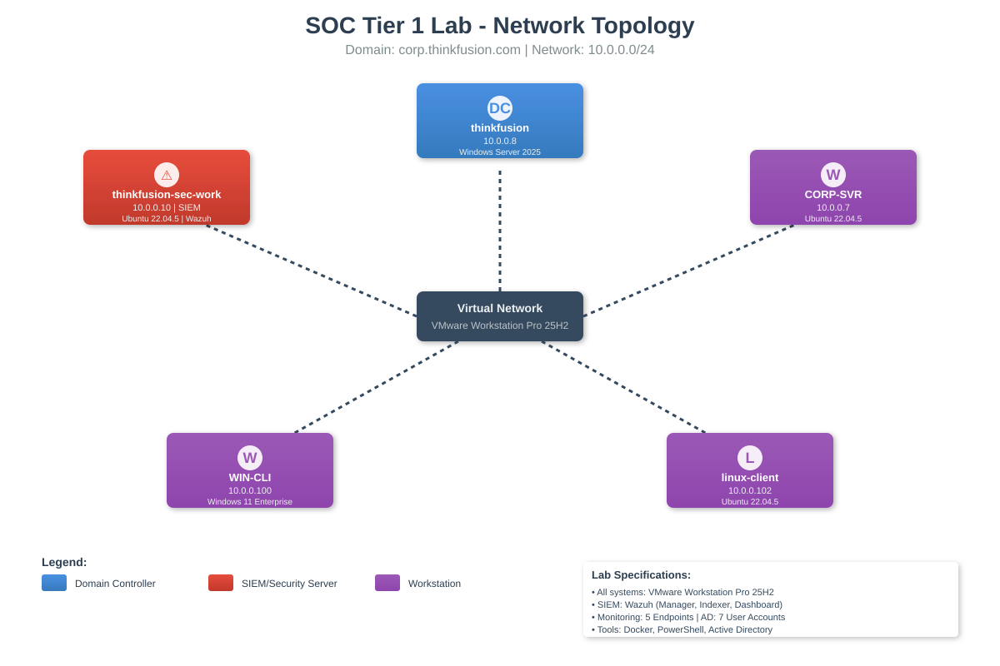
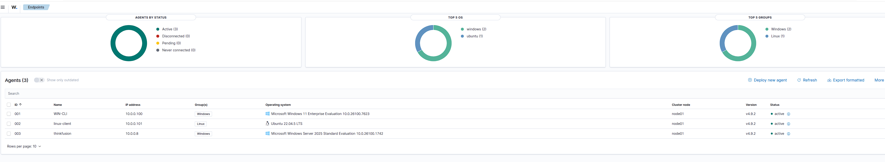
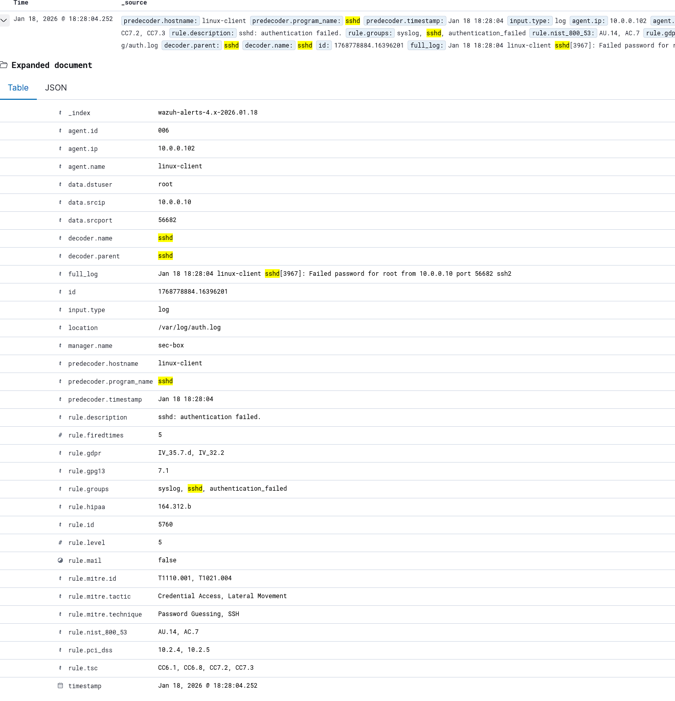
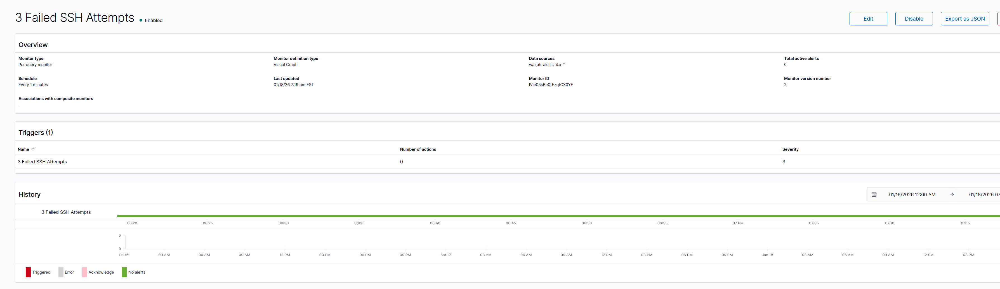
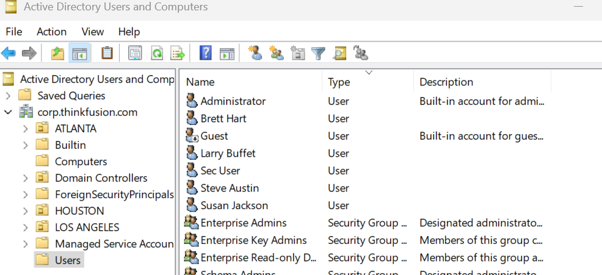

# SOC Tier 1 Lab - Security Operations & Log Analysis

A hands-on security operations lab designed to develop practical skills in SIEM management, log analysis, and identity access management. This project demonstrates technical competencies aligned with CompTIA CySA+ certification objectives and real-world SOC operations.

## 🎯 Objectives

- Implement and configure enterprise SIEM for security monitoring
- Perform log analysis and threat detection
- Manage Active Directory users and access controls
- Practice incident detection and alerting workflows
- Document security operations procedures

## 🏗️ Lab Architecture

### Enterprise Environment: ThinkFusion

| Hostname | IP Address | OS | Purpose | Specs |
|----------|-----------|-----|---------|-------|
| **thinkfusion** | 10.0.0.8 | Windows Server 2025 | Domain Controller | 4GB RAM, 4 vCPU, 64GB Storage |
| **WIN-CLI** | 10.0.0.100 | Windows 11 Enterprise | Client Workstation | 4GB RAM, 4 vCPU, 64GB Storage |
| **thinkfusion-sec-work** | 10.0.0.10 | Ubuntu 22.04.5 | SIEM Server | 4GB RAM, 2 vCPU, 80GB Storage |
| **linux-client** | 10.0.0.102 | Ubuntu 22.04.5 | Linux Workstation | 4GB RAM, 2 vCPU, 80GB Storage |
| **CORP-SVR** | 10.0.0.7 | Ubuntu 22.04.5 | Corporate Server | 4GB RAM, 2 vCPU, 80GB Storage |

**Hypervisor:** VMware Workstation Pro 25H2

*Screenshot: Lab network topology*

## 🛠️ Tools & Technologies

- **SIEM:** Wazuh (Manager, Indexer, Dashboard)
- **Containerization:** Docker
- **Identity Management:** Active Directory on Windows Server 2025
- **Automation:** PowerShell
- **Monitoring:** Custom Wazuh detection rules and monitors

## 🔬 Lab Activities

### 1. SIEM Deployment & Configuration

**Wazuh Implementation:**
- Deployed Wazuh SIEM on dedicated Ubuntu server (10.0.0.10)
- Configured Wazuh Manager, Indexer, and Dashboard components
- Integrated Windows and Linux endpoints as monitored agents

*Screenshot: Wazuh dashboard showing active agents*

### 2. SSH Brute Force Detection

**Objective:** Detect and alert on failed SSH authentication attempts

**Implementation:**
- Utilized Wazuh built-in SSH detection rules
- Generated test events by attempting SSH login with incorrect credentials to linux-client (10.0.0.102)
- Analyzed authentication logs through Wazuh dashboard

**Alerting Configuration:**
- Created custom monitor with 1-minute intervals
- Trigger threshold: 3 failed SSH attempts
- Alert severity: Medium

*Screenshot: Wazuh alert showing failed SSH attempt*

*Screenshot: Custom monitor settings for SSH detection*

### 3. Active Directory User Management

**Domain:** corp.thinkfusion.com

**Users Created:**
- Brett Hart
- Larry Buffet
- Sec User
- Steve Austin
- Susan Jackson

*Screenshot: AD Users and Computers console showing created accounts*

**Activities:**
- Created organizational structure
- Configured user accounts and permissions
- Implemented group policies
- Tested authentication across domain-joined systems

## 💡 Key Learnings

### Technical Challenges & Resolutions

**Wazuh Service Management:**
- **Issue:** Wazuh-indexer and Wazuh-manager failed to start automatically on system boot
- **Root Cause:** Default timeout value (180s) insufficient for service initialization
- **Resolution:** Modified `TimeStartSec` parameter from 180 to 0 in systemd service files
- **Outcome:** Services now start successfully on boot

**VMware Snapshot Management:**
- **Issue:** Snapshot corruption leading to VM instability and data loss
- **Root Cause:** Long-lived snapshots causing disk chain corruption
- **Resolution:** Modified VM configuration files to point to original disk files
- **Lesson Learned:** Snapshots are designed for short-term use; avoid long-term reliance. Implement proper backup strategies for production environments.

## 📊 Skills Demonstrated

- SIEM deployment and administration (Wazuh)
- Log analysis and correlation
- Security event monitoring and alerting
- Active Directory administration
- Windows and Linux system administration
- Virtualization and infrastructure management
- Troubleshooting and problem resolution
- Security operations documentation

## 🎓 Certifications Prepared For

- CompTIA CySA+ (Cybersecurity Analyst)

## 🚀 Future Detection Log Analysis

- [ ] Detect Sensitive Files
- [ ] WinRM Logon
- [ ] Password Spraying
- [ ] Credential Stuffing
- [ ] Kerberoasting
- [ ] Pass the Hash attack
- [ ] Linux Sudo Exploitation

## 🚀 Future Enhancements

- [ ] Integrate additional detection rules for Windows Event Logs
- [ ] Implement file integrity monitoring (FIM)
- [ ] Configure automated incident response playbooks
- [ ] Add network traffic analysis with packet capture
- [ ] Integrate threat intelligence feeds
- [ ] Create custom dashboards for security metrics
- [ ] Implement SOAR capabilities with Shuffle/TheHive

---

**Project Status:** Active Development  
**Last Updated:** January 2026

