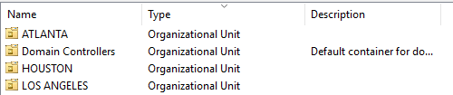

# SOC Tier 1 Home Lab - Detection & Response Environment

## Overview

This project is a fully functional Security Operations Center (SOC) environment built to develop hands-on skills in threat detection, incident response, and security monitoring. The lab simulates a small enterprise network with an Active Directory domain, cross-platform endpoints, and centralized SIEM monitoring—replicating the infrastructure a Tier 1 SOC Analyst would defend in production.

The environment focuses on real-world SOC workflows including log analysis, alert triage, threat hunting, and incident investigation. By integrating Wazuh SIEM with domain-joined endpoints, I can simulate attacks, generate security telemetry, validate detection rules, and practice the investigative techniques essential for SOC operations.

---

## Network Topology


**Network Details:**
- **Network Segment:** 10.0.0.0/24
- **Domain Controller:** 10.0.0.8
- **IP Assignment:** Static addressing (no DHCP configured)
- **Gateway:** 10.0.0.1
- **DNS:** Handled by DC (10.0.0.8)

```
┌─────────────────────────────────────────────────┐
│       VMware Workstation Pro - SOC Lab          │
│                                                 │
│  ┌───────────────────────────────────────────┐  │
│  │  Domain: corp.thinkfusion                 │  │
│  │  DC: 10.0.0.8 (Windows Server 2025)       │  │
│  │                                           │  │
│  │  ┌─────────────────────────────────────┐  │  │
│  │  │   SEC-BOX (Wazuh SIEM Manager)      │  │  │
│  │  │   • Alert Correlation               │  │  │
│  │  │   • Log Analysis                    │  │  │
│  │  │   • Incident Detection              │  │  │
│  │  └─────────────────────────────────────┘  │  │
│  │           ▲         ▲         ▲           │  │
│  │           │         │         │           │  │
│  │  [Wazuh Agents Reporting Logs]           │  │
│  │           │         │         │           │  │
│  │  ┌────────┴──┐  ┌──┴─────┐  ┌┴─────────┐ │  │
│  │  │ WIN-CLI   │  │   DC   │  │ LINUX-   │ │  │
│  │  │ (Windows) │  │(Server)│  │ CLIENT   │ │  │
│  │  └───────────┘  └────────┘  └──────────┘ │  │
│  └───────────────────────────────────────────┘  │
└─────────────────────────────────────────────────┘
```

---

## Technologies Used

| Component | Technology |
|-----------|------------|
| **Hypervisor** | VMware Workstation Pro |
| **Domain Controller OS** | Windows Server 2025 |
| **Domain Name** | corp.thinkfusion |
| **SIEM Platform** | Wazuh 4.9.2 (Open-source XDR/SIEM) |
| **Endpoint OS** | Windows 10/11, Ubuntu 22.04 LTS |
| **Log Sources** | Windows Event Logs, Sysmon, Linux Auth Logs, AD Security Events |
| **Network** | 10.0.0.0/24 private subnet (static IPs) |
| **Monitoring Focus** | Authentication events, privilege escalation, lateral movement, malware execution |

---

## Lab Architecture

### SIEM Infrastructure - SEC-BOX

**Platform:** Wazuh Manager 4.9.2 on Ubuntu 22.04  
**Primary Functions:**
- Centralized log collection and correlation
- Real-time security event monitoring
- Alert generation and triage
- Incident investigation and forensics
- Threat intelligence integration

**Current Monitoring Status:**
- **Active Agents:** 3/3
- **Agent Groups Configured:** 3 (default, Linux, Windows)
- **Group Distribution:** 
  - **default:** 0 agents (baseline group)
  - **Linux:** 1 agent (linux-client)
  - **Windows:** 2 agents (WIN-CLI, thinkfusion)
- **OS Distribution:** Windows (2), Ubuntu (1)

This group structure enables OS-specific detection rules, tailored monitoring policies, and scalable SIEM management aligned with enterprise best practices.


*Wazuh dashboard showing 3 active agents across the domain*

**Monitored Log Sources:**
- Windows Security Event Logs (Event IDs 4624, 4625, 4672, 4688, etc.)
- Active Directory authentication events
- Linux system logs (auth.log, syslog)
- Sysmon telemetry (process creation, network connections)
- File integrity monitoring on critical directories


*All domain endpoints reporting to Wazuh manager*

### Domain Controller Configuration

**Hostname:** thinkfusion  
**IP Address:** 10.0.0.8/24  
**Roles:**
- Active Directory Domain Services
- DNS Server
- Wazuh Agent (forwarding security logs to SIEM)


*Server Manager with AD DS and monitoring agent installed*

**Security Logging Enabled:**
- Account logon events
- Account management changes
- Directory service access
- Policy changes
- Privilege use

### Active Directory Structure

**Domain:** corp.thinkfusion

**Organizational Units:**
```
corp.thinkfusion
├── ATLANTA
├── LOS ANGELES
└── HOUSTON
```


*Geographic OUs for simulating multi-site enterprise*

This structure allows testing location-based detection rules and understanding how adversaries might move laterally between different office locations.

### User Accounts

Created to simulate various roles and test authentication monitoring:

| Display Name | Username | Purpose/Role |
|--------------|----------|--------------|
| Sec User | suser | Security operations / admin testing |
| Steve Austin | saustin | Standard user account |
| Brett Hart | bhart | Standard user account |


*User accounts for testing detection scenarios*

**SOC Use Cases:**
- Monitor failed login attempts across accounts
- Detect unusual authentication patterns (time, location)
- Identify privilege escalation attempts
- Track lateral movement between endpoints

### Monitored Endpoints

| Agent ID | Hostname | IP Address | OS | Status | Version |
|----------|----------|------------|-----|--------|---------|
| 001 | WIN-CLI | 10.0.0.10 | Windows 11 Enterprise | Active | v4.9.2 |
| 002 | linux-client | 10.0.0.102 (IPv1) | Ubuntu 22.04.5 LTS | Active | v4.9.2 |
| 003 | thinkfusion | 10.0.0.8 | Windows Server 2025 | Active | v4.9.2 |


*All three agents reporting actively to Wazuh manager*

**Agent Details:**

1. **WIN-CLI (Agent 001)** - Windows 11 Enterprise Evaluation
   - **Edition:** Windows 11 Enterprise Evaluation (Version 24H2, Build 26100.1742)
   - **Domain Status:** Successfully joined to corp.thinkfusion.com
   - **Installed:** January 15, 2026
   - Wazuh agent v4.9.2 installed
   - Sysmon configured for enhanced process telemetry
   - Simulated user workstation for testing malware, phishing scenarios
   
2. **linux-client (Agent 002)** - Ubuntu 22.04.5 LTS
   - Wazuh agent v4.9.2 installed
   - Domain-joined via SSSD
   - Tests cross-platform attack detection
   
3. **thinkfusion (Agent 003)** - Windows Server 2025
   - Wazuh agent v4.9.2 installed (Domain Controller)
   - Monitors critical AD security events
   - Tests domain controller compromise scenarios


*All endpoints joined to corp.thinkfusion domain*

---

## SOC Workflows & Detection Capabilities

### Alert Triage Process


*Real-time security alerts requiring triage*

**Workflow:**
1. Alert generated by Wazuh correlation rules
2. Initial classification (True Positive / False Positive / Benign Positive)
3. Severity assessment based on MITRE ATT&CK mapping
4. Investigation using raw log data
5. Documentation and escalation if needed

### Detection Use Cases Implemented

**Authentication Monitoring:**
- Failed login attempts (Event ID 4625)
- Successful logons from unusual hours
- Account lockouts
- Authentication from new endpoints

**Privilege Escalation:**
- Special privileges assigned to tokens (Event ID 4672)
- User added to privileged groups (Event ID 4728, 4732)
- Service creation with SYSTEM privileges

**Lateral Movement:**
- Remote authentication events
- New network logons (Event ID 4624 Type 3)
- Admin share access
- Remote service creation

**Execution & Persistence:**
- Process creation monitoring via Sysmon
- Scheduled task creation
- Suspicious PowerShell execution
- Registry modifications for persistence


*Timeline view of correlated security events during simulated incident*

---

## Implementation Process

### 1. Environment Setup
- Installed and configured VMware Workstation Pro
- Created isolated virtual network (10.0.0.0/24) for controlled testing
- Configured static IP addressing scheme for all systems
- Allocated appropriate resources (RAM, CPU, storage) per VM

### 2. Domain Infrastructure Deployment
- Installed Windows Server 2025 on dedicated VM
- Configured static IP addressing (10.0.0.8/24)
- Promoted server to Domain Controller
- Created corp.thinkfusion domain
- Configured DNS zones for name resolution
- Enabled detailed security auditing on DC


*Active Directory Domain Services installation*


*DNS zones configured for domain*

### 3. Active Directory Configuration
- Designed OU structure for geographic separation
- Created user accounts following enterprise naming standards
- Configured audit policies for security event logging
- Enabled advanced audit policy configuration
- Documented baseline authentication patterns

### 4. Endpoint Deployment & Domain Join
- Configured WIN-CLI with static IP (10.0.0.10) and DNS pointing to DC (10.0.0.8)
- Successfully joined Windows 11 Enterprise client to corp.thinkfusion.com domain
- Integrated Ubuntu 22.04 client using realm and SSSD
- Verified cross-platform authentication
- Tested user login from different machines and OUs
- Confirmed domain membership via System Properties on all endpoints


*Windows 11 Enterprise showing successful domain join to corp.thinkfusion.com*


*Ubuntu client authenticating via Active Directory*

### 5. SIEM Deployment & Configuration
- Deployed Wazuh Manager 4.9.2 on SEC-BOX (Ubuntu 22.04)
- Configured Wazuh server with appropriate resources
- Installed Wazuh agents on all endpoints (DC, WIN-CLI, LINUX-CLIENT)
- Configured log forwarding from Windows Event Logs
- Enabled Sysmon integration for enhanced Windows telemetry
- Created agent groups for organized monitoring (default, Linux, Windows)
- Configured group-specific policies and detection rules


*Wazuh agent installation and enrollment*


*Agent groups configured for OS-specific monitoring and rule application*

### 6. Detection Rule Development
- Configured built-in Wazuh rules for authentication monitoring
- Created custom rules for domain-specific events
- Mapped detections to MITRE ATT&CK framework
- Tuned alert thresholds to reduce false positives
- Documented detection logic and expected triggers


*Custom detection rules for AD-specific threats*

### 7. Testing & Validation
- Simulated failed login attempts to generate alerts
- Tested privilege escalation detection
- Validated log collection from all endpoints
- Confirmed alert generation and notification
- Practiced investigation workflow using Wazuh interface
- Documented baseline activity for future anomaly detection

---

## Simulated Attack Scenarios & Detections

### Scenario 1: Brute Force Authentication Attack
**Objective:** Detect repeated failed login attempts  
**Execution:** Multiple failed SSH/RDP attempts against domain users  
**Detection:** Wazuh rule triggers on 5+ failed attempts within 2 minutes  
**Response:** Alert generated, source IP identified, account status verified


*Wazuh detecting authentication brute force attempt*

### Scenario 2: Suspicious Process Execution
**Objective:** Identify potentially malicious process creation  
**Execution:** PowerShell script execution with encoded commands  
**Detection:** Sysmon Event ID 1 + PowerShell command line analysis  
**Response:** Process tree investigation, command decoding, threat assessment

### Scenario 3: Privilege Escalation Attempt
**Objective:** Detect unauthorized elevation of privileges  
**Execution:** Standard user added to Domain Admins group  
**Detection:** Windows Event ID 4728 monitored by Wazuh  
**Response:** Alert triggered, group membership verified, change authorization confirmed


*Detecting unauthorized group membership changes*

---

## Key Challenges & Solutions

**Challenge:** High volume of noise from legitimate authentication events  
**Solution:** Established baseline activity patterns, tuned alert thresholds, created suppression rules for known-good behavior

**Challenge:** Wazuh agent connectivity issues on Windows endpoints  
**Solution:** Configured Windows Firewall rules for ports 1514/1515, verified agent registration, troubleshot using agent.log files

**Challenge:** Correlating events across multiple endpoints  
**Solution:** Leveraged Wazuh's correlation engine, created custom decoders for AD-specific logs, used timestamps for timeline reconstruction

**Challenge:** False positives from legitimate administrative activity  
**Solution:** Created separate rules for expected admin actions, implemented time-based suppression, documented authorized changes

**Challenge:** Ubuntu SSSD integration with AD for proper log context  
**Solution:** Configured SSSD with detailed logging, ensured Kerberos authentication worked properly, verified user context in Wazuh logs

---

## Lessons Learned

**SOC Operations:**
- **Context is Everything:** Raw alerts mean nothing without understanding normal baseline activity
- **Tuning is Continuous:** Detection rules require ongoing refinement to balance sensitivity with alert fatigue
- **Documentation Saves Time:** Maintaining a runbook for common alerts speeds up triage significantly
- **Think Like an Attacker:** Understanding attack chains (MITRE ATT&CK) makes detection logic more effective

**Technical Skills:**
- **Log Quality Matters:** Sysmon dramatically improves detection capabilities on Windows—default Event Logs aren't enough
- **Correlation is Powerful:** Single events are alerts; correlated events tell a story
- **Cross-Platform Complexity:** Linux + Windows monitoring requires different approaches and parsers
- **SIEM != Magic:** Wazuh detects what you configure it to detect—garbage in, garbage out

**Practical Insights:**
- Static IPs simplified incident investigation and tracking
- Having a test domain allowed breaking things without fear
- Simulating attacks yourself is the best way to validate detections
- Real SOC work is 80% investigation, 20% response

---

## Future Enhancements

### Short-Term (Next 30 Days)
- [ ] Deploy Sysmon on all Windows endpoints with SwiftOnSecurity config
- [ ] Create playbooks for top 5 alert types
- [ ] Implement file integrity monitoring on critical directories
- [ ] Add threat intelligence feed integration (AbuseIPDB, AlienVault OTX)
- [ ] Simulate phishing attack with malicious attachment

### Medium-Term (Next 90 Days)
- [ ] Deploy vulnerability scanner (OpenVAS/Nessus) and correlate findings
- [ ] Implement Group Policy Objects for security baselines
- [ ] Create custom Wazuh dashboard for executive reporting
- [ ] Add honeypot system to detect scanning/enumeration
- [ ] Simulate ransomware attack (in controlled manner) and validate detection

### Long-Term (Next 6 Months)
- [ ] Build automated response capabilities (SOAR workflows)
- [ ] Integrate threat hunting queries and saved searches
- [ ] Create full incident response documentation for each attack type
- [ ] Add packet capture analysis (Zeek/Suricata integration)
- [ ] Simulate APT-style attack campaign with persistence and C2
- [ ] Implement tiered administrative model (Tier 0/1/2)

---

## SOC Analyst Skills Demonstrated

**Core SOC Skills:**
- Security event monitoring and alert triage
- Log analysis across Windows and Linux platforms
- Incident detection and investigation
- SIEM configuration and rule development
- Threat hunting and proactive detection
- MITRE ATT&CK framework mapping
- False positive reduction and tuning

**Technical Capabilities:**
- Active Directory security architecture
- Windows Server 2025 administration
- Wazuh SIEM deployment and management
- Cross-platform endpoint monitoring
- DNS and network services configuration
- Sysmon and EDR-style telemetry collection
- Static IP management and network design
- Virtualization with VMware Workstation Pro

**Analytical Skills:**
- Attack chain reconstruction
- Timeline analysis and correlation
- Root cause analysis
- Baseline behavioral analysis
- Risk assessment and prioritization

---

## Resources & References

**SOC & Detection Engineering:**
- MITRE ATT&CK Framework
- Wazuh Documentation - Detection Rules
- Florian Roth's Detection Engineering Blog
- SANS SOC Survey and Best Practices

**Tools & Platforms:**
- Wazuh Open Source XDR/SIEM
- Sysmon Configuration (SwiftOnSecurity)
- Microsoft Active Directory Security Best Practices
- Ubuntu SSSD Active Directory Integration

**Learning Resources:**
- Blue Team Labs Online
- LetsDefend.io SOC Analyst Path
- TryHackMe SOC Level 1 Path

---

**Lab Status:** Active Development | **Last Updated:** January 2026

**Note:** This is an isolated lab environment using RFC 1918 private addressing. All attack simulations are conducted in a controlled setting for educational purposes only.